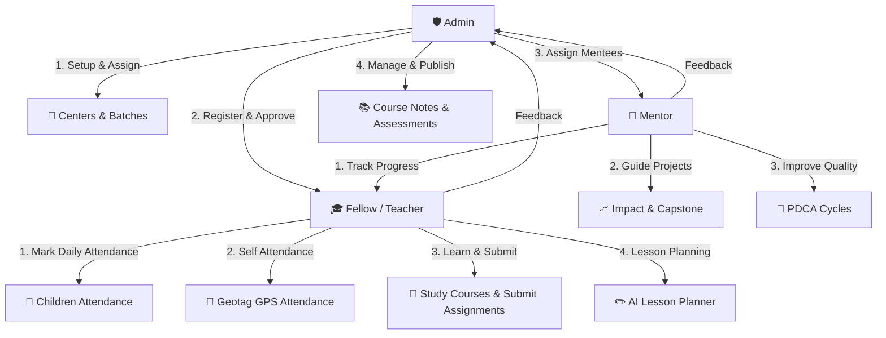

# SpaceCE Teacher Portal — Roles & Workflow Document (भूमिका आणि कार्यप्रवाह दस्तऐवज)

हा दस्तऐवज SpaceCE Teacher Portal मधील तीन प्रमुख भूमिका (**Admin**, **Fellow/Teacher**, आणि **Mentor**) चे अधिकार, कार्यप्रवाह (Workflow) आणि ऍक्सेस (Access) सविस्तरपणे स्पष्ट करतो.

This document describes the detailed workflows, access control, and responsibilities for the three primary roles on the SpaceCE Teacher Portal: **Admin**, **Fellow/Teacher**, and **Mentor**.

---

## 🗺️ System Overview (प्रणालीचा आढावा)

---

## 1. 🛡️ Admin Workflow & Access (प्रशासक कार्यप्रवाह आणि प्रवेश)

Admin हा संपूर्ण प्रणालीचा नियंत्रक (Controller) आहे. सर्व युजर्स, अभ्यासक्रम, आणि केंद्रांचे व्यवस्थापन ॲडमीनद्वारे केले जाते.

### 🔑 Key Access & Tabs (प्रमुख टॅब्स आणि प्रवेश):
1. **Admin Dashboard (Overview - विहंगावलोकन):** 
   - शिक्षक संख्या, कोर्सेस, बॅचेस आणि चालू सत्रांची संख्या एकाच ठिकाणी पाहणे.
2. **Center Management (केंद्र व्यवस्थापन):**
   - नवीन केंद्रे जोडणे, केंद्रांची माहिती अद्ययावत करणे आणि शिक्षकांना विशिष्ट केंद्र देणे.
3. **Teacher Management (शिक्षक व्यवस्थापन):**
   - नवीन शिक्षकांच्या नोंदणी विनंत्या (Pending Registrations) तपासणे आणि मंजूर (Approve) करणे. शिक्षकांचे प्रोफाईल नियंत्रित करणे.
4. **Course Management (अभ्यासक्रम व्यवस्थापन):**
   - नवीन कोर्सेस तयार करणे, कोर्स नोट्स अपलोड करणे, आणि धडे समाविष्ट करणे.
5. **Activity Monitoring (कृती निरीक्षण):**
   - शिक्षकांनी वर्गातून अपलोड केलेले फोटो आणि व्हिडिओ तपासणे.
6. **Lesson Plans & AI Lesson Planner (पाठ नियोजन):**
   - पाठ नियोजनाचे नियंत्रण आणि शिक्षकांसाठी AI द्वारे पाठ नियोजन पर्याय देणे.
7. **Children & Classes (मुले आणि वर्ग व्यवस्थापन):**
   - नवीन विद्यार्थ्यांची नोंदणी, त्यांना विशिष्ट वर्गांत (Classes) वाटप करणे.
8. **Trainer Management (प्रशिक्षक व्यवस्थापन):**
   - कोर्सेस घेणाऱ्या ट्रेनर्सची यादी आणि बॅचेस व्यवस्थापित करणे.
9. **Assignment Review (असाइनमेंट पुनरावलोकन):**
   - शिक्षकांनी सबमिट केलेल्या असाइनमेंट्सचे मूल्यमापन करणे. खालील निकषांनुसार गुण (Marks) देणे:
     - Content accuracy (25 गुण)
     - Age-appropriate planning (25 गुण)
     - Presentation and clarity (20 गुण)
     - Practical classroom use (30 गुण)
10. **Reports & Analytics (अहवाल आणि विश्लेषण):**
    - शिक्षक कामगिरी, हजेरी आणि कोर्स प्रगतीचे सविस्तर अहवाल डाउनलोड करणे.
11. **Feedback Management (अभिप्राय व्यवस्थापन):**
    - शिक्षक आणि मेंटर्सनी पाठवलेले अभिप्राय वाचणे आणि त्यांना उत्तरे (Admin Response) देणे.

### 🔄 Admin Workflow (कार्यप्रवाह):
1. **युझर मंजुरी (User Approval):** नवीन शिक्षक किंवा मेंटर नोंदणी करतो तेव्हा ॲडमीन त्याला सक्रिय (Active) करतो.
2. **अभ्यासक्रम वाटप (Course & Center Assignment):** शिक्षकाला योग्य केंद्र आणि कोर्सेस दिले जातात.
3. **मूल्यमापन आणि ग्रेडिंग (Grading & Review):** शिक्षकांनी पाठवलेल्या असाइनमेंट तपासून त्यांना फीडबॅक देणे आणि मंजुरी (Approve/Revision) देणे.

---

## 2. 🎓 Fellow / Teacher Workflow & Access (शिक्षक / फेलो कार्यप्रवाह)

Fellows (शिक्षिका/शिक्षक) थेट वर्गात काम करतात आणि पोर्टलचा वापर स्वतःच्या प्रशिक्षणासाठी आणि मुलांच्या व्यवस्थापनासाठी करतात.

### 🔑 Key Access & Tabs (प्रमुख टॅब्स आणि प्रवेश):
1. **Teacher's Dashboard (मुख्य डॅशबोर्ड):**
   - स्वतःची हजेरी टक्केवारी, राहिलेली कामे (Pending Tasks), जिंकलेली प्रमाणपत्रे आणि वर्गाची थोडक्यात माहिती पाहणे.
2. **Daily Attendance (दैनिक मुले हजेरी):**
   - वर्गातील मुलांची दररोजची हजेरी (Present / Absent) नोंदवणे.
3. **Geotag Attendance (स्थान-आधारित हजेरी):**
   - स्वतःची दैनंदिन हजेरी नोंदवण्यासाठी GPS लोकेशन (Latitude, Longitude) आणि फोटो सबमिट करणे.
4. **My Courses & Assessments (माझे अभ्यासक्रम आणि मूल्यांकन):**
   - वाटप केलेल्या कोर्स नोट्स वाचणे, विषयाचा अभ्यास करणे आणि प्रगती (Progress) जतन करणे.
   - कोर्स पूर्ण झाल्यावर मूल्यमापन परीक्षा (Proctored Assessments) आणि असाइनमेंट सबमिट करणे.
5. **AI Lesson Planner (AI पाठ नियोजक):**
   - वर्गासाठी योग्य आणि रंजक पाठ नियोजन (Lesson Plan) तयार करण्यासाठी AI चा वापर करणे.
6. **Certificates (प्रमाणपत्रे):**
   - यशस्वीरित्या पूर्ण केलेल्या कोर्सची अधिकृत PDF प्रमाणपत्रे पाहणे आणि डाउनलोड करणे.
7. **Feedback (अभिप्राय):**
   - कोर्स आणि ट्रेनरविषयी निनावी (Anonymous) किंवा स्वतःच्या नावाने अभिप्राय देणे.
8. **AI Chatbot (AI सहाय्यक):**
   - वर्गातील अध्यापन पद्धती, हजेरी समस्या किंवा इतर तांत्रिक मदतीसाठी चॅटबॉटशी संवाद साधणे.

### 🔄 Teacher Workflow (कार्यप्रवाह):
1. **दैनंदिन कार्य (Daily Loop):** सकाळी Geotag द्वारे स्वतःची हजेरी लावणे ➡️ वर्गातील मुलांची हजेरी घेणे ➡️ AI पाठ नियोजकाचा वापर करून शिकवणे.
2. **अध्ययन कार्य (Learning Loop):** 'My Courses' मधील नोट्स वाचणे ➡️ सराव करणे ➡️ 'Assessments' सबमिट करणे ➡️ गुण मिळाल्यावर प्रमाणपत्र मिळवणे.

---

## 3. 💼 Mentor Workflow & Access (मार्गदर्शक कार्यप्रवाह)

Mentor (मार्गदर्शक) शिक्षकांना (Fellows) मार्गदर्शन करतो, त्यांच्या अध्यापन कौशल्याचे निरीक्षण करतो आणि गुणवत्तेत सुधारणा करतो.

### 🔑 Key Access & Tabs (प्रमुख टॅब्स आणि प्रवेश):
1. **Overview (आढावा):**
   - नियुक्त केलेले केंद्र (Working Center), मेंटी (Mentees) शिक्षकांची संख्या आणि एकूण प्रभाव स्कोअर (Impact Score) पाहणे.
2. **Mentee Management (मेंटी व्यवस्थापन):**
   - आपल्या अंतर्गत असलेल्या सर्व फेलो (शिक्षक) ची यादी पाहणे.
   - त्यांच्या प्रशिक्षणाची प्रगती, वर्गातील कामगिरी आणि हजेरीवर लक्ष ठेवणे.
3. **Impact & Capstone (प्रभाव आणि कॅपस्टोन):**
   - शिक्षकांच्या कॅपस्टोन प्रोजेक्ट्सची (Capstone Projects) प्रगती तपासणे, त्यांना मार्गदर्शन करणे.
4. **Documentation - PDCA (नियोजन-कृती-तपासणी-सुधारणा):**
   - केंद्राच्या आणि शिक्षकांच्या गुणवत्तेसाठी **PDCA Cycles** (Plan, Do, Check, Act) दस्तऐवजीकरण तयार करणे आणि अद्ययावत करणे.
5. **Notifications & Feedback (सूचना आणि अभिप्राय):**
   - नवीन सूचना मिळवणे आणि ॲडमीनला सुधारणांसाठी अभिप्राय देणे.

### 🔄 Mentor Workflow (कार्यप्रवाह):
1. **शिक्षकांना मार्गदर्शन (Mentee Tracking):** शिक्षकांच्या वर्ग कृतींचे निरीक्षण करणे.
2. **गुणवत्ता नियंत्रण (Quality Circle):** PDCA फॉर्म भरून कोणत्या शिक्षकाला कुठे मदतीची गरज आहे हे नोंदवणे.
3. **ॲडमीन समन्वय (Admin Coordination):** केंद्र सुधारणेचा अहवाल ॲडमीनपर्यंत पोहोचवणे.

---

## 📈 Role Comparison Quick-Table (भूमिकांची तुलनात्मक तक्ता)

| वैशिष्ट्ये / Features | 🛡️ Admin | 🎓 Fellow (Teacher) | 💼 Mentor |
| :--- | :---: | :---: | :---: |
| **User Management** | ✅ full control | ❌ read-only self | ⚠️ assigned mentees only |
| **Daily Children Attendance** | ⚠️ read reports | ✅ write/mark | ❌ no write |
| **Geotag Self Attendance** | ❌ not required | ✅ must submit | ❌ not required |
| **Course Creation** | ✅ create & edit | ❌ read/learn only | ❌ no edit |
| **Grading & Certification** | ✅ grade & issue | ❌ read/receive only | ❌ no grading |
| **AI Lesson Planner** | ✅ yes | ✅ yes | ❌ no |
| **PDCA Quality Logs** | ✅ view all | ❌ no | ✅ write & maintain |
| **Feedback Submission** | ⚠️ replies to it | ✅ submits feedback | ✅ submits feedback |
